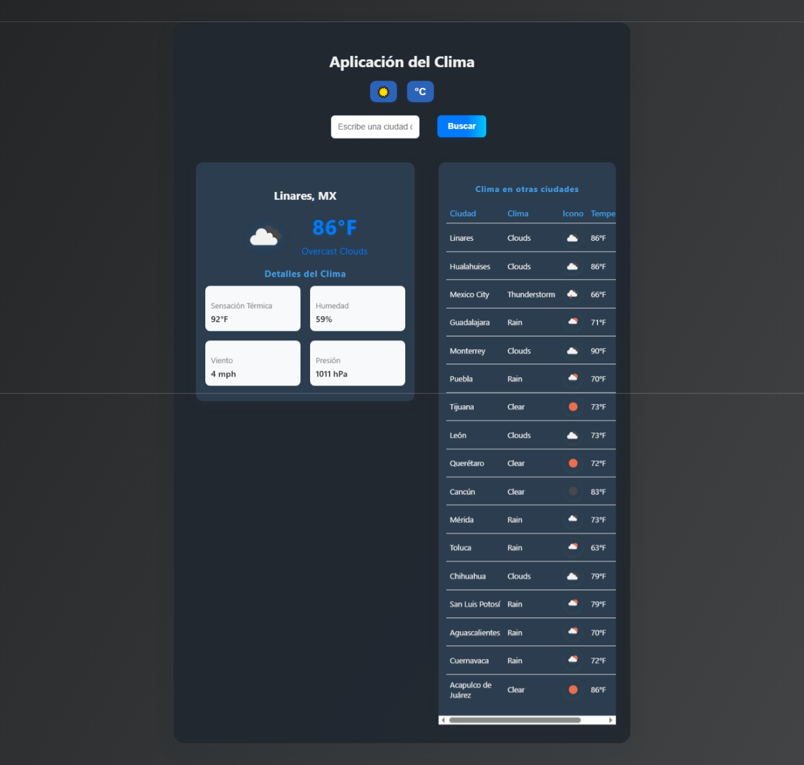

# 🌦️ App Clima

Aplicación web interactiva para consultar el clima actual en ciudades. Incluye modo claro/oscuro, tabla comparativa y detalles meteorológicos visuales.

---

##  Características

-  **Búsqueda rápida** de ciudadess.
-  **Tabla comparativa** con clima, temperatura e íconos para varias ciudades.
-  **Modo claro y oscuro** con cambio instantáneo.
-  **Detalles meteorológicos**: humedad, presión, viento y sensación térmica.
-  **Íconos visuales** del clima en cada ciudad.

## Vista previa

---

##  Requisitos

- [Node.js](https://nodejs.org/) >= 18.20.2
- [npm](https://www.npmjs.com/) >= 10.5.0

---

##  Instalación

1. **Clona el repositorio:**

   ```bash
   git clone https://github.com/Arkan2601/App-Clima
   cd app-clima
   ```

2. **Instala las dependencias:**

   ```bash
   npm install
   ```

3. **Configura tu API Key de OpenWeatherMap:**

   - Crea un archivo `.env` en la raíz del proyecto.
   - Añade tu API Key:

     ```
     REACT_APP_OPENWEATHER_API_KEY=tu_api_key_aqui
     ```

   - Obtén tu API Key gratuita en [OpenWeatherMap](https://openweathermap.org/api).

---

## 🖥️ Ejecución en local

```bash
npm start
```

Accede a la app en: [http://localhost:3000](http://localhost:3000)

---

##  Dependencias principales

- [React](https://react.dev/)
- [OpenWeatherMap API](https://openweathermap.org/api)

---

## 🎨 Personalización

- Modifica la lista de ciudades en  
  `src/components/CitiesWeatherTable.jsx`.
- Personaliza estilos en  
  `src/App.css`.

---

## 🚢 Despliegue

Para crear una versión de producción:

```bash
npm run build
```

Esto generará la carpeta `build` lista para desplegar en cualquier hosting estático.

---

## 📂 Estructura de archivos

```
app-clima/
├── src/
│   ├── components/
│   │   ├── SearchBar.jsx
│   │   ├── WeatherCard.jsx
│   │   ├── WeatherDetails.jsx
│   │   └── CitiesWeatherTable.jsx
│   ├── App.js
│   ├── App.css
│   └── index.js
├── .env
├── .gitignore
├── package.json
└── README.md
```

---

## 💡 Notas

- El archivo `.env` **no se sube** al repositorio por seguridad.
- Puedes cambiar entre °C y °F y alternar el tema claro/oscuro desde la interfaz.

---

## ✨ ¡Disfruta tu app del clima!
